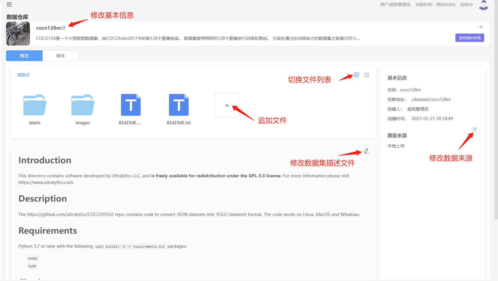

## 简介
深度学习算法的效果离不开高质量数据集，数据集用于对数据的管理，支持NFS、ceph和S3等存储
## 创建数据集
### 操作步骤
1、进入“数据集”界面  
2、点击“新增”按钮  
3、填写表单信息  
<table>
<tr><td>参数</td><td>描述</td></tr>
<tr><td>名称</td><td>数据集的名称5-40之间，必填</td></tr>
<tr><td>挂载路径</td><td>在模型开发和模型训练时，数据挂载到容器里的目录名称，只能时字母和数字，并且只能字母开发</td></tr>
<tr><td>数据类型</td><td>数据集的类型、图片、文本、视频、表格等</td></tr>
<tr><td>配图</td><td>任务的配图，非必填</td></tr>
<tr><td>描述</td><td>对数据集的描述</td></tr> 
</table> 
3、点击“下一步”按钮，进入文件上传界面  
4、选择“本地上传”或者“S3接入”，本地上传是指通过上传本地数据集到服务器的存储上，S3接入表示数据集使用S3上的数据，关于S3的数据集请参考S3数据集管理。  
5、选择“本地上传”以后，上传本地的文件，支持文件夹和文件上传。数据集比较大时请使用cli上传，关于cli请参考cli章节  
6、 点击“确定”按钮    
7、数据集创建成功以后，点击“立即前往”，进入数据集“详情页”  

## 修改数据集  
1、进入“数据集”界面  
2、选中数据集进入"详情页” 
  
### 修改基本信息 
1、点击数据集名称旁边的修改按钮，弹出对话框，修改基本信息  
2、填写修改的表单信息  
3、点击“确定”按钮，保存修改记录  
### 修改数据来源
1、 点击右边数据来源旁边的修改按钮，弹出对话框。  
2、修改数据来源  
3、点击”确定“，保存修改信息  
### 修改描述信息
1、 数据集描述信息采用Markdown格式、点击修改按钮可以进行在线编辑
### 追加文件  
1、在工作区中点击“+”按钮进行追加文件
### 删除文件  
1、 选中文件，右键弹出菜单，点击“删除”按钮，删除文件
## 删除数据集  
1、进入“数据集”界面    
2、选中数据集进入，移动到删除按钮旁，会弹出删除按钮。  
3、弹出确认删除的对话框，点击“确认”按钮，删除数据集  

