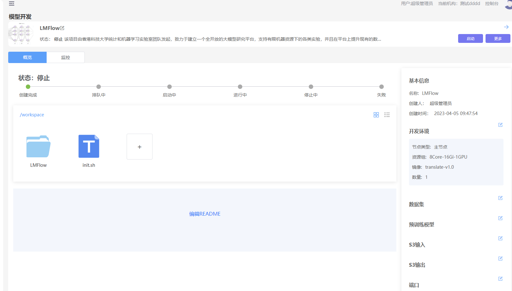

## 简介
JupyterLab是Jupyter Notebook的全面升级。JupyterLab 是一个集 Jupyter Notebook、文本编辑器、终端以及各种个性化组件于一体的全能IDE,相比Jupyter Notebook，JupyterLab能够打开更多的文件格式，除了代码文件（.py、.cpp），还包括CSV、JSON、Markdown、PDF。
## 操作步骤
1、进入“模型开发”页面  
2、点击“新增”按钮  
3、填写表单信息、类型选择“Jupyter”  
<table>
<tr><td>参数</td><td>描述</td></tr>
<tr><td>名称</td><td>模型开发任务的名称，长度在5-40之间，必填</td></tr>
<tr><td>描述</td><td>对任务的描述，必填</td></tr>
<tr><td>配图</td><td>任务的配图，非必填</td></tr>
<tr><td>环境（主节点）</td><td>环境是平台预制的开发环境，分为公开（平台发布的）、共享（每个租户内部共享）、私有（每个用户独享）</td></tr>
<tr><td>资源组</td><td>平台将内存、CPU、GPU打包一组资源组让用户使用，资源组由管理员在控制台维护</td></tr>  
</table>  
4、点击“确定”，进入“详情页”  
    
5、点击“启动”按钮，等待一会，详情页的进度条会显示启动的进度    
6 等待状态变成“运行中”，点击“进入”按钮，即可进入JupyterLab  

