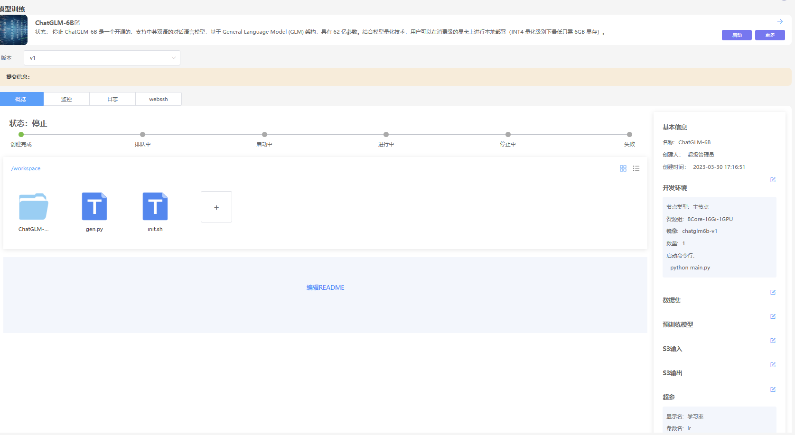

## 模型训练
由于大部分的模型训练时间比较长，可以通过模型训练功能将模型开发完成的算法进行训练。模型训练是按照优先级排队执行。模型训练可以充分利用系统的资源。模型训练通过版本管理每次训练的环境、代码、超参等、可以非常方便的进行模型的复现。通过可以通过对比不同版本之间的差异。
## 创建任务
1、进入“模型训练”界面  
2、点击“新增”按钮  
3、填写表单信息 
<table>
<tr><td>参数</td><td>描述</td></tr>
<tr><td>名称</td><td>模型训练任务的名称，长度在5-40之间，必填</td></tr>
<tr><td>描述</td><td>对任务的描述，必填</td></tr>
<tr><td>环境</td><td>环境是平台预制的开发环境，分为公开（平台发布的）、共享（每个租户内部共享）、私有（每个用户独享）</td></tr>
<tr><td>资源组</td><td>平台将内存、CPU、GPU打包一组资源组让用户使用，资源组由管理员在控制台维护</td></tr>
<tr><td>主节点/子节点</td><td>平台支持分布式的开发，一个任务可以开启一个主节点和多组子节点</td></tr>
<tr><td>数据集</td><td>数据集以文件形式挂载到容器里，目录为:/dataset/{数据集别名}</td></tr>
<tr><td>超参</td><td>用于填写训练用的超参，通过启动命令行后面拼接超参传递给程序，超参支持通过argparse进行解析</td></tr>
<tr><td>S3输入</td><td>支持将S3以文件系统方式挂载到容器里，目录为:/input/{名称}</td></tr>
<tr><td>预训练模型</td><td>支持将模型以文件系统方式挂载到容器里，目录为: /model/{名称}</td></tr>
<tr><td>S3输出</td><td>用于将数据写入S3，支持将S3以文件系统方式挂载到容器里，目录为:/input/{名称}</td></tr>
<tr><td>端口映射</td><td>用于将容器里的端口映射，可以通过映射端口访问容器内端口</td></tr>
</table>
4、 点击“确定”按钮      
5、创建成功以后，可以在详情页上传自己的文件  
  
## 启动
1、进入“模型训练”界面    
2、选中项目，点击进入详情页   
3、点击“启动”按钮（如果任务是运行状态，启动按钮不显示） 
4、等待一段时间，可以查看工作区中的进度条，查看容器状态  
5、等待状态改为“运行中”，容器会运行执行启动命令行中的命令。
6、命令行执行完成以后，会自动释放容器。  
## 停止
1、进入“模型训练”界面    
2、选中项目，点击进入详情页   
3、点击“停止”按钮（如果任务不是“运行中”，停止按钮不显示） 
4、等待一段时间，可以查看工作区中的进度条，查看容器状态  
## 导出模型
导出模型用于将训练好的模型导入到模型管理模块。
1、 点击“更多”按钮
2、 点击“导出模型”模块
3、 在弹出框中选中需要导出的模型文件
4、 点击“确定”按钮
5、 在弹出的“模型管理”界面上，填写表单信息。
6、 点击“确定”按钮
## 复制训练任务
复制用于将当前的训练任务复制出一个副本，可以修改超参等，同时进行多个版本的训练。
1、 点击“复制”按钮
## 修改模型训练  
1、进入“模型训练”界面  
2、选中修改的记录进入"详情页” 
### 修改基本信息 
1、点击名称旁边的修改按钮，弹出对话框，修改基本信息  
2、填写修改的表单信息  
3、点击“确定”按钮，保存修改记录  
### 修改开发环境
1、点击开发环境旁边的修改按钮，弹出对话框，修改环境信息  
2、填写修改的表单信息  
3、点击“确定”按钮，保存修改记录  
### 追加文件  
1、在工作区中点击“+”按钮进行追加文件
### 删除文件  
1、 选中文件，右键弹出菜单，点击“删除”按钮，删除文件
## 删除  
1、进入“模型训练”界面    
2、选中模型训练任务，移动到删除按钮旁，会弹出删除按钮。  
3、弹出确认删除的对话框，点击“确认”按钮，删除模型训练  
